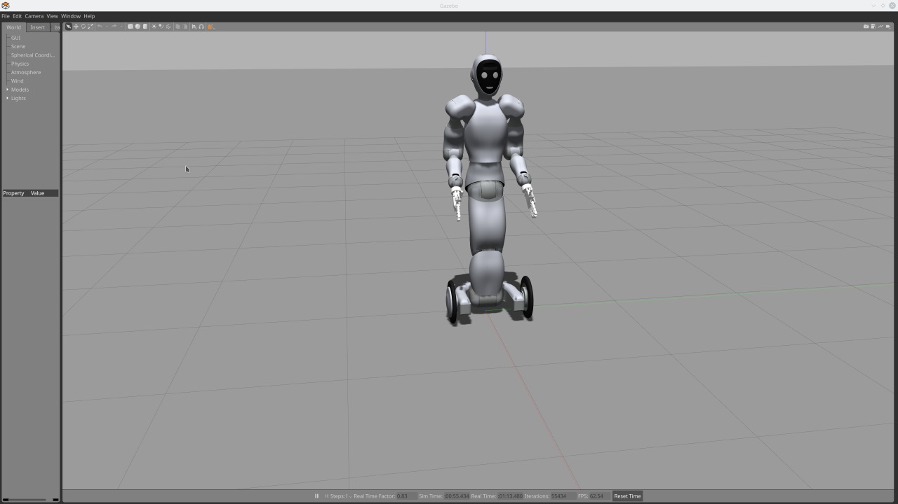

# Eve Controller Workspace Setup with Gazebo simulation

Instructions maintained by: will@halodi.com



Prerequisites:
* Ubuntu 18.04
* A machine with graphics acceleration capability
* (Optional) An ssh-key for your Github account on your machine. If you haven't set one up, see [these instructions](https://help.github.com/en/github/authenticating-to-github/generating-a-new-ssh-key-and-adding-it-to-the-ssh-agent)

The following steps describe the process for setting up your ROS 2 workspace to
develop with the EVE Gazebo simulation.

1. Install [ROS 2 - Eloquent](https://index.ros.org/doc/ros2/Installation/Eloquent/)
2. Install the following:
  ```bash
  sudo apt update
  sudo apt install git python3-colcon-common-extensions python3-vcstool swig3.0 xsltproc gazebo9 ros-eloquent-gazebo-ros-pkgs 
  ```
3. Create ROS 2 a workspace:
  ```bash
  mkdir -p ~/eve_ws/src
  cd ~/eve_ws/src
  ```
4. In your workspace src directory, import the libraries
  ```bash
  wget https://raw.githubusercontent.com/Halodi/halodi-controller/master/eve_ws_https.repos .
  vcs import < ./eve_ws_https.repos
  ```
  OR (If you use ssh-keys with your GitHub account)
  ```bash
  wget https://raw.githubusercontent.com/Halodi/halodi-controller/master/eve_ws.repos .
  vcs import < ./halodi-controller-simulation-api/eve_ws.repos
  ```
5. Download the the lastest ROS2 Workspace Eve controller [here](https://github.com/Halodi/halodi-controller/releases) to your Downloads folder. Choose the latest Linux version.
6. Extract it to your workspace:
  ```bash
  cd ~/eve_ws/src
  tar -xzf ~/Downloads/halodi-controller-linux64-0.1.0.tar.gz
  ````
7. Build and source the workspace:
  ```bash
  cd ~/eve_ws
  colcon build
  . install/setup.bash
  ```
8. Launch the EVE Gazebo sim:
```bash
ros2 launch halodi-controller-gazebo halodi-controller-gazebo.launch.py
```

