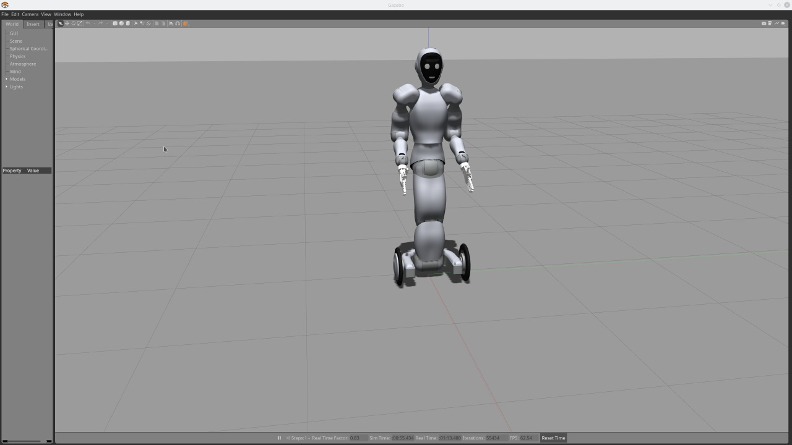

# Eve Controller Workspace Setup with Gazebo simulation





## Supported ROS2 version

The simulation plugin supports ROS2 - Foxy on Ubuntu 20.04. 

For Ros2 - Eloquent on Ubuntu 18.04 see the EOL branch: [eloquent-eol](https://github.com/Halodi/halodi-controller/tree/eloquent-eol).

## Documentation

- [API Documentation](https://github.com/Halodi/halodi-messages)


## Controller Quick start

The controller comes bundled with [Simulation Construction Set](https://github.com/ihmcrobotics/simulation-construction-set) (SCS). SCS is a simulation developed by IHMC with physics tuned to balance control development. Manipulation support is lacking. We use this simulator internally for the development of the balance algorithm.


### Installation

To install, download the latest release for your platform [here](https://github.com/Halodi/halodi-controller/releases) and unpack to a suitable location on our hard drive. 


In the bundle you'll find a number of scripts (.bat on Windows) to start various applications:

- SCSEveSimulation: Simulation of the whole robot
- EveVisualizer: Allows connection to the robot and inspect the controller variables online.
- SCSVisualizer: Allows connection to the robot and inspect the controller variables online. This application is also able to connect to the controller plugin.
- EveJointEncoderCalibrationVisualizer: Recalibration of the joint encoders on Eve.
- EveSimulationPluginInstaller: Install a link to the controller for use in the plugin.
- DeployFirmwareToEve: Tool to deploy Firmware to Eve.

To communicate with the robot, use the API found at [halodi-messages](https://github.com/Halodi/halodi-messages). This simulator has built-in ROS2 support.

## ROS2/Gazebo Quick start installation

Prerequisites:

* Ubuntu 20.04
* A machine with graphics acceleration capability
* Internet connectivity (to download the JDK dependencies)
* (Optional) An ssh-key for your Github account on your machine. If you haven't set one up, see [these instructions](https://help.github.com/en/github/authenticating-to-github/generating-a-new-ssh-key-and-adding-it-to-the-ssh-agent)

The following steps describe the process for setting up your ROS 2 workspace to
develop with the EVE Gazebo simulation.

1. Install [ROS 2 - Foxy](https://index.ros.org/doc/ros2/Installation/Foxy/Linux-Install-Debians/)
2. Install the following:

  ```bash
  sudo apt update
  sudo apt install git python3-colcon-common-extensions python3-vcstool xsltproc gazebo11 ros-foxy-gazebo-ros-pkgs
  ```
3. Create ROS 2 a workspace:

  ```bash
  mkdir -p ~/eve_ws/src
  cd ~/eve_ws/src
  ```
4. In your workspace src directory, import the libraries

  ```bash
  wget https://raw.githubusercontent.com/Halodi/halodi-controller/main/eve_ws_https.repos .
  vcs import < ./eve_ws_https.repos
  ```
  OR (If you use ssh-keys with your GitHub account)
  
  ```bash
  wget https://raw.githubusercontent.com/Halodi/halodi-controller/main/eve_ws.repos .
  vcs import < ./eve_ws.repos
  ```
5. Make sure you have installed the halodi-controller. See the Instalation chapter above this chapter.
6. Build and source the workspace:

  ```bash
  . /opt/ros/foxy/setup.bash
  cd ~/eve_ws
  colcon build
  . install/local_setup.bash
  ```
7. Launch the EVE Gazebo sim:

```bash
ros2 launch halodi-controller-gazebo halodi-controller-gazebo.launch.py
```

To disable the trajectory API and use the realtime API pass "trajectory-api:=false" as argument.

```bash
ros2 launch halodi-controller-gazebo halodi-controller-gazebo.launch.py trajectory-api:=false
```

To connect "SCSVisualizer" from the controller installation to the Gazebo instance to tune variables, add "variable-server:=true" as argument.
```bash
ros2 launch halodi-controller-gazebo halodi-controller-gazebo.launch.py variable-server:=true
```

## Required ROS2 packages

To run the simulation, you need the following packages in your ROS2 workspace.

- [halodi-controller-simulation-api](https://github.com/Halodi/halodi-controller-simulation-api) Branch: main
- [halodi-messages](https://github.com/Halodi/halodi-messages) Branch: main
- [halodi-robot-models](https://github.com/Halodi/halodi-robot-models)  Branch: main
