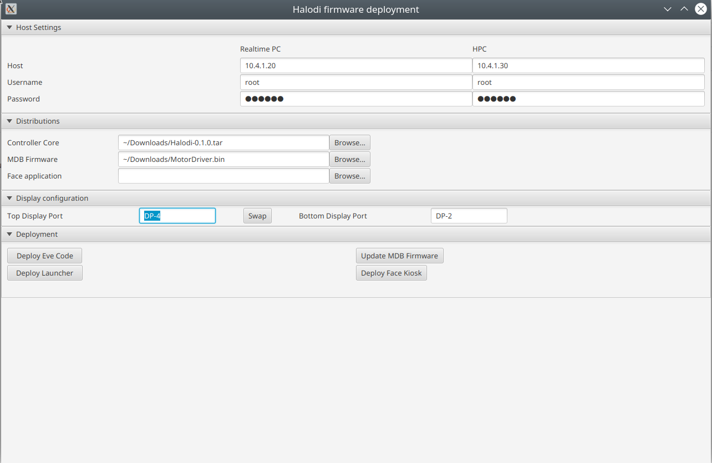

# Deplying new firmware

This tutorial assumes you are deploying from a Linux PC. Deployment from a Windows PC is unstested.

## Required downloads

From [releases](https://github.com/Halodi/halodi-controller/releases/latest) download

- halodi-controller-linux64-0.1.0.tar.gz
- Halodi-0.1.0.tar
- MotorDriver.bin

## Upgrade

Unpack halodi-controller-linux64-0.1.0.tar.gz and in the folder "halodi-controller-linux64" you'll find the "DeployFirmwareToEve" application. Start this application.

You will now see the firmware deployment tool

Set the host for the Realtime PC and HPC to match your robot. The default Username and Password should work, if you changed the login details enter them here.

Under "Distributions", select the right firmware packages

- Controller Core: This should be Halodi-0.1.0.tar you downloaded.
- MDB Firmware: This should be MotorDriver.bin you downloaded.
- Face application: This should be 

### Deployment

Under the "Deployment" tab, you'll find four options. 

#### Deploy Eve Code

This updates the realtime balance firmware. This updates to the newest API and functionality. You need the "Controller Core" package for this.

#### Update Launcher

This updates the web interface running on both the Realtime PC and HPC. Run this to update the launcher, leaving the balance controller untouched.

Note: If the launcher fails to start after an upgrade of the underlying ubuntu packages, this will usually fix the launcher.

#### Update MDB Firmware

This updates the firmware on the motor driver boards. You need the MDB firmware for this.

Note: This will take a few minutes. If it fails, power cycle the robot and try again. 

#### Deploy face kiosk

This uploads a new version of the face animations. Currently there is no new release available.
